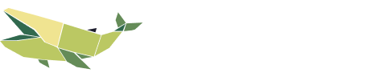

<center>
  
</center>

# inwhale

[](https://www.python.org/)
<a href="https://github.com/psf/black"></a>

**inwhale** is an educational library for understanding, implementing, and experimenting with quantization techniques used in machine learning, signal processing, and large language model (LLM) compression.

The project is designed to be **readable first, correct second, fast third**.  
Every quantizer is meant to be studied, modified, and reasoned about, not treated as a black box.

This is **not** a drop-in inference engine.  
It is a learning, research, and experimentation toolkit.

## Why inwhale exists

Quantization literature is fragmented:
- papers explain ideas but hide implementation details
- libraries optimize for performance, not understanding
- newcomers struggle to connect math, code, and behavior

inwhale aims to close that gap by providing:
- clear, minimal implementations of quantization methods
- explicit numerical conventions and assumptions
- small demos that show *what actually happens*

## What inwhale covers

inwhale focuses on the full quantization stack, including:

- Uniform and non-uniform quantization
- Rounding strategies and observers
- Post-training quantization (PTQ)
- Quantization-aware training (QAT)
- LLM-specific quantization methods
- Calibration and error correction techniques

The full roadmap and implementation status live in **[TODO.md](TODO.md)**.

## Project status

inwhale is under active development.

Current focus:
- Core quantizer abstractions
- Uniform quantization (symmetric -> asymmetric -> affine)
- Testable, reference-quality behavior

Expect breaking changes early on.

## Installation

```bash
git clone https://github.com/datavorous/inwhale.git
cd inwhale

python3 -m venv .venv
source .venv/bin/activate # Linux/macOS
# .venv\Scripts\activate # Windows

pip install -e .
pip install uv
uv install

uv run examples/uniform_demo.py
```

## Quick start

```python
import torch
from inwhale.core.uniform import SymmetricUniformQuantizer
from inwhale.observers.minmax import MinMaxObserver
from inwhale.rounding.nearest import NearestRounding

x = torch.tensor([1.2, -0.7, 0.4, 2.3, -1.9])

observer = MinMaxObserver()
rounding = NearestRounding()
quant = SymmetricUniformQuantizer(bits=8, observer=observer, rounding=rounding)

qx = quant.quantize(x)
dx = quant.dequantize(qx)

print("Original:", x)
print("Quantized:", qx)
print("Dequantized:", dx)
print("Absolute error:", (x - dx).abs())
```

This example demonstrates a basic uniform quantization to dequantization cycle.
More demos will be added alongside each implemented method.

## Contributing

Contributions are welcome and encouraged.

* Start with **[TODO.md](TODO.md)** to find scoped tasks
* Read **[CONTRIBUTING.md](CONTRIBUTING.md)** for coding rules and workflow
* Beginner-friendly issues focus on core quantization concepts

This project values **clarity over cleverness** and **correctness over speed**.

## Design philosophy 

* Explicit math beats implicit magic
* Simple code beats micro-optimizations
* Every quantizer should be testable in isolation
* If a behavior is surprising, it should be documented

## License

MIT